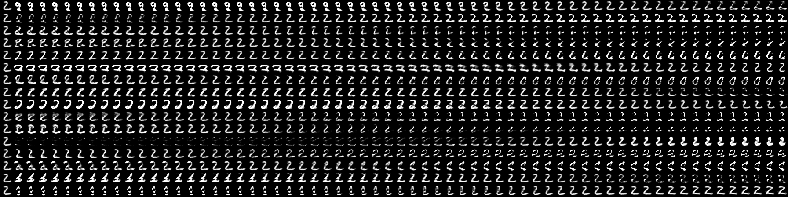

# CapsNet

### Geoffrey Hinton's paper 
* [Dynamic Routing Between Capsules](https://arxiv.org/abs/1710.09829)  
* [MATRIX CAPSULES WITH EM ROUTING](https://openreview.net/pdf?id=HJWLfGWRb)

### Result
1. 重构(Reconstruction)  

2. Paper 5.1: What the individual dimensions of a capsule represent 

### Run

### Data
* mnist

### Reference
* [naturomics/CapsNet-Tensorflow](https://github.com/naturomics/CapsNet-Tensorflow)
